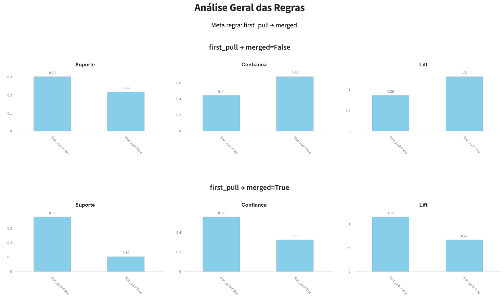
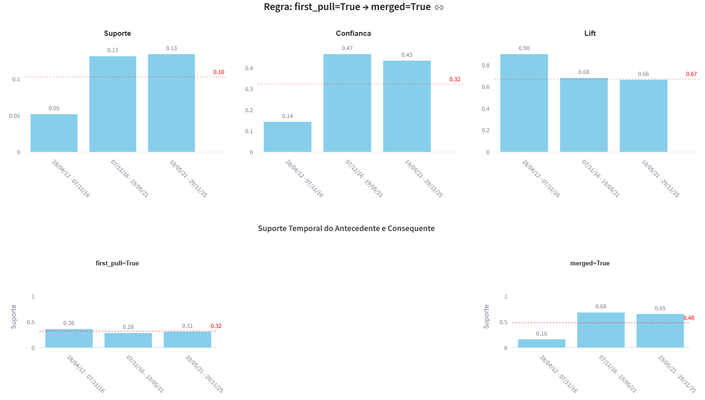

## TEMAR - Temporal Association Rule Analyzer

TEMAR is a web-based tool developed to support the temporal analysis of association rules extracted from Software Engineering datasets, especially data obtained from pull requests of open-source software repositories.

The tool applies the Apriori algorithm to discover association rules and allows users to analyze how rule quality measures evolve over time, including:

Support
Confidence
Lift

The system supports multiple temporal partitioning strategies, enabling researchers to investigate how association patterns change during software evolution.


## Features

Features
Import CSV datasets
Mine association rules using Apriori
Configure minimum support and confidence
Temporal partitioning
 Manual temporal milestones
 Equal-size intervals
 Equal-number-of-records partitions
Compare rule evolution over time
Interactive visualizations
Plot Support, Confidence and Lift


## Repository Organization

├── main_com_mlxtend.py                      # Streamlit application

├── requirements.txt                         # Python dependencies

├── datasets/                                # Example datasets

├── paper/                                   # Paper Accepted at SBES 2026

├── analysis.py                              # Streamlit auxiliar functions

├── LICENSE

└── README.md


## Associated Paper

This artifact accompanies the paper:

TEMAR: Uma Ferramenta para Análise Temporal de Regras de Associação em Dados de Repositórios de Software

Accepted at SBES 2026.

[paper](./paper/paper_TEMAR_SBES2026.pdf) 

## Requirements

Python 3.12

Tested on:

- Windows 11

Required libraries:

- numpy==2.3.2
- pandas
- matplotlib
- mlxtend
- plotly
- streamlit
- streamlit-option-men
- streamlit-sortables==0.3.1
- python-dateutil

Hardware requirements

- 4 GB RAM minimum
- 500 MB free disk space

No GPU is required.


## Installation

Clone the repository

```git clone --branch v1.0.2 https://github.com/silvana21/toolTemp.git```

Enter the project

```cd toolTemp```

Create a virtual environment (optional)

```python -m venv .venv```

Activate the environment

Windows

```.venv\Scripts\activate```

Linux/macOS

```source .venv/bin/activate```

Install dependencies

```pip install -r requirements.txt```

Running the Tool

```
streamlit run main_com_mlxtend.py
```

The application should start a local Streamlit server and display a message similar to:

Local URL:
http://localhost:8501

Open the URL in a web browser.


## Input Data

The tool expects CSV files containing categorical attributes.
Continuous and temporal attributes must be discretized beforehand, when necessary, for inclusion in association rule mining.


## Example Workflow

- Run the application.
- Load one of the sample CSV files.
- Configure minimum support and confidence.
- Choose the rules to analyze.
- Run the mining process for the complete dataset.
- Choose the partitioning strategy.
- Configure minimum support and confidence to temporal analysis.
- Run the mining process for the partitioned datasets.
- View the charts.


## Example Datasets

The datasets/ directory contains example datasets extracted from open-source software repositories for demonstrating and testing the TemAR tool.

Each CSV file includes categorical data derived from pull requests, contributors, and code review outcomes. These datasets can be directly loaded through the TemAR interface to explore the tool's temporal association rule mining capabilities.

To use an example dataset:

- Launch the application.
- Select Load Dataset.
- Choose one of the CSV files available in the datasets/ directory.
- Configure the mining parameters and chose the rules to analyze.
- Run the analysis and explore the temporal visualizations presented.


## Reproducible Validation Example

### Load CSV Tab

In the **Carregar CSV** tab, upload the dataset:

`datasets/django.csv`

Verify that the dataset is loaded successfully before proceeding to the next tab.

### General Rules Tab

In the **Regras Gerais** tab, configure the analysis as follows:

- **Suporte mínimo:** 1.00%
- **Confiança mínima:** 1.00%
- **Meta-regra:** `first_pull → merged`

Run the general analysis. The following results are expected:

**Rule:** `first_pull=False → merged=False`

| Metric	|  Expected Value |
| --- | --- |
| Support | 0.30 |
| Confidence | 0.44 |
| Lift | 0.86 |


**Rule:** `first_pull=True → merged=False`

| Metric	  |Expected Value |
| --- | --- |
| Support  |	       0.22   |
| Confidence	|   0.68 |
| Lift	    |   1.31 |

**Rule:** `first_pull=False → merged=True`

| Metric | 	  Expected Value |
| --- | --- |
| Support |	       0.38 |
|Confidence	|   0.56 |
|Lift |	       1.15 |

**Rule:** `first_pull=True → merged=True`

| Metric | 	  Expected Value |
| --- | --- |
| Support	|       0.10 |
| Confidence |	   0.32 |
| Lift	|       0.67 |



### Temporal Analysis Tab

In the **Análise Temporal** tab:

- **Particionamento da Base de Dados:** Select: Mesmo tamanho temporal
- **Núm. partições:** 3

The dataset covers the period from **28/04/2012 to 29/11/2025**. The tool divided this period into three temporal partitions with approximately equal durations:

| Partition | Start Date | End Date | Records | Duration |
|---|---|---|---:|---|
| P1 | 28/04/2012 | 07/11/2016 | 5,310 | 4 years, 6 months, 10 days |
| P2 | 07/11/2016 | 19/05/2021 | 5,116 | 4 years, 6 months, 11 days |
| P3 | 19/05/2021 | 29/11/2025 | 3,967 | 4 years, 6 months, 9 days |

Configure the analysis as follows:

- **Suporte mínimo:** 1.00%
- **Confiança mínima:** 1.00%
- **Meta-regra:** `first_pull → merged` (Selected in the General Analysis)

Run the temporal analysis. The following results are expected:

| Partition | Support | Confidence | Lift |
|---|---:|---:|---:|
| P1 | 0.05 | 0.14 | 0.90 |
| P2 | 0.13 | 0.47 | 0.68 |
| P3 | 0.13 | 0.43 | 0.67 |

The results show that the rule metrics vary across the temporal partitions. Support increases from 0.05 in P1 to 0.13 in P2 and remains stable in P3. Confidence increases from 0.14 in P1 to 0.47 in P2, followed by a slight decrease to 0.43 in P3. Lift decreases from 0.90 in P1 to 0.68 in P2 and 0.67 in P3.




## License

MIT License.


## Citation

This version of the artifact is archived on Zenodo:

DOI: [will be updated after the new Zenodo version is published]


## Author

Silvana de Andrade Gonçalves

Universidade Federal Fluminense (UFF)

Instituto Federal do Acre (IFAC)
